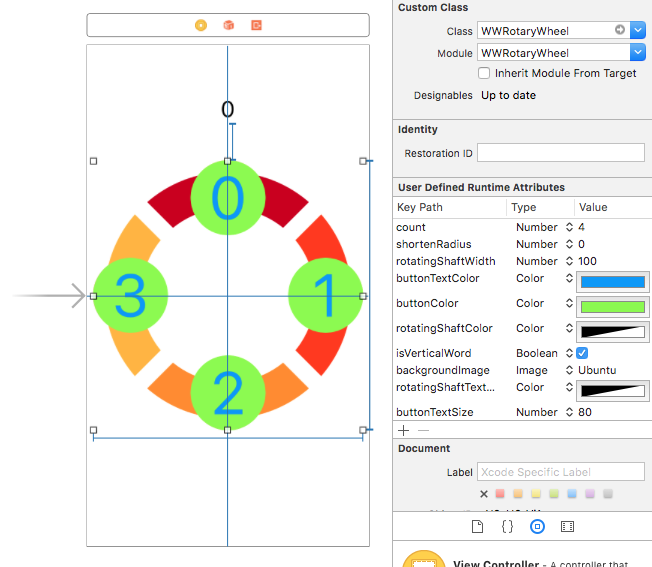

# WWSegmentControl
一個自訂有QQ動畫的SegmentControl

[](https://developer.apple.com/swift/) [](http://cocoapods.org/pods/WWRotaryWheel) [](http://cocoapods.org/pods/WWRotaryWheel) [](http://cocoapods.org/pods/WWRotaryWheel)


# 使用範例


```swift
import UIKit
import WWSegmentControl

class ViewController: UIViewController {

    @IBOutlet weak var myRotaryWheel: WWRotaryWheel!
    @IBOutlet weak var myLabel: UILabel!
    
    override func viewDidLoad() {
        super.viewDidLoad()
        myRotaryWheel.delegate = self
        myRotaryWheel.imageSetting([#imageLiteral(resourceName: "list"), #imageLiteral(resourceName: "like"), #imageLiteral(resourceName: "meeting"), #imageLiteral(resourceName: "plus"), #imageLiteral(resourceName: "check-mark")])
    }

    override func didReceiveMemoryWarning() {
        super.didReceiveMemoryWarning()
    }
}

extension ViewController: WWRotaryWheelDelegate {
    
    func wwRotaryWheel(_ wwRotaryWheel: WWRotaryWheel, clickedItemAt index: Int, for buttons: [UIButton]) {
        myLabel.text = index.description
    }
    
    func wwRotaryWheel(_ wwRotaryWheel: WWRotaryWheel, selectedItemAt index: Int, for buttons: [UIButton]) {
        for button in buttons { button.backgroundColor = .clear }
        buttons[index].backgroundColor = .yellow
    }
}
```